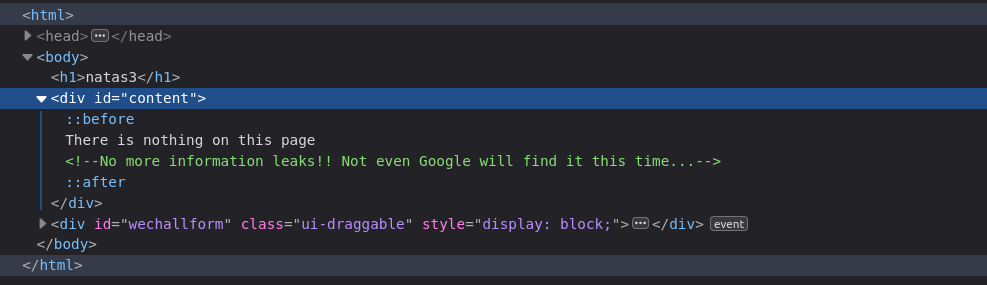
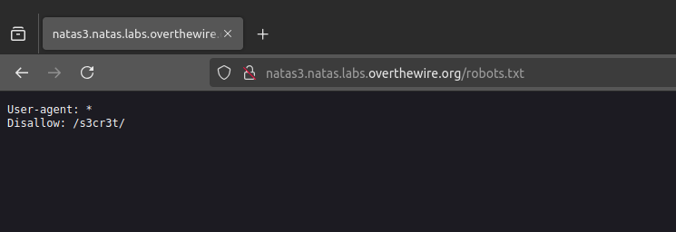

# Natas 3
In this challenge it seems that there is any problem, but it gives you a big hint in the HTML:

What prevent Google, and research engine in general, to find your page?
The robots.txt file!

 The robots.txt says that there is a page that is not listed in the research engines "/s3"