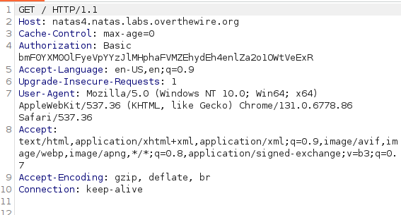

# Natas 4
Also here you have an hint from the challenge: 
" Access disallowed. You are visiting from "" while authorized users should come only from "http://natas5.natas.labs.overthewire.org/" "

At the beginning i did not understand what he was referring to, but i was positive that it was talking about the HTTP request, so i opened Burp and used the proxy tool to look at it:

We can se that the request for the root directory is made with the Referer "http://natas4.natas.labs.overthewire.org/", so i tried to change it with "http://natas5.natas.labs.overthewire.org/" .
with this modification you have the password for the next challenge:
0n35PkggAPm2zbEpOU802c0x0Msn1ToK

# Close up
Since i've never seen the **Referer** header in http request